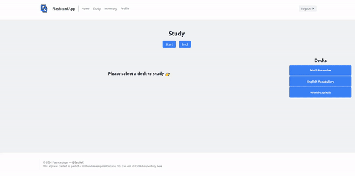

This application was developed as a final project for a frontend webdev course.

# FlashcardApp

FlashcardApp is a web application (Frontend only) designed for reviewing question-answer flashcards based on Spaced Repetition Systems (SRS). Users can create and organize decks and their respective flashcards to study them, facilitating the learning and retention of diverse information. The application operates in a manner similar to a simplified version of popular tools like Anki ([AnkiWeb](https://apps.ankiweb.net/)) or Brainscape ([Brainscape](https://www.brainscape.com/)), for smaller sets of information: the user reviews a deck and all wrong flashcards are stored for a later review session, allowing the user to focus on their mistakes.

## Live Demo [](https://app.netlify.com/sites/sebillekflashcards/deploys)

[Check out the live demo on Netlify](https://sebillekflashcards.netlify.app/)\*\*





\*\* Please note that for simplicity's sake, the live demo does not use JSON Server API as the project does; instead, it relies on a static JSON file.

## Installation and Setup

If you want to try it out for yourself you can follow these steps to run the project on your local machine:

1. Clone this repository

```bash
git clone https://github.com/SebilleK/FlashcardApp
```

2. Navigate to the project directory and install dependencies

```bash
cd FlashcardApp
npm install
```

3. Start development server and the JSON-Server API

```bash
npm run dev
```

and finally, open http://localhost:5173/ on your browser. Make sure you're opening the correct port, change it if need be.
You can login with the following credentials to test the app:

username: random-guy

password: random-password

(see all the example users on the data.json file)

## Tech Stack

This project used:

- React (with Routing for navigation and Redux for state management)
- JSON-Server API (for simulating all information used in the app for each user — personal info & decks/flashcards)
- Tailwind CSS and custom CSS w/ SCSS (see Resources for libraries used)

## Functionalities

### Study:

- Study the decks through the study interface: after selecting a deck and starting the study session, they can go through each flashcard of the deck seeing the question, showing its answer, and marking the flashcard as correct or for further review. At the end of the session, a new review deck will appear on the user decks, which will store all flashcards marked for review in the future.

- Review incorrect cards to reinforce their proper memorizing when needed through the review deck. When studying the review deck, correct cards will be deleted from it while incorrect ones (marked for review again) will be kept.

### Inventory:

- Create new decks

- Edit & delete their existing decks/flashcards: after selecting a deck, they can modify it by editing the deck itself ("Edit Selected Deck" button > changing the deck name or adding new flashcards) or by flashcard (editing the question and answer of a specific flashcard on the deck selection screen). They can also delete a deck ("Delete Selected Deck" button).\*\*

\*\* Feature available only to devices with screen width upwards of 600px.

### Profile:

- See a simplified profile, with their currently registered email and username, and their deck count.

- Modify their username and email.

## Resources Used

### Component Styling:

- [Tailblocks](https://tailblocks.cc/): Base styling for all pages.
- [Layouts for Tailwind](https://layoutsfortailwind.lalokalabs.dev/): Used for helping with some layouts.

### Other Resources:

- [SVG Repo](https://www.svgrepo.com/): Source for Logo SVG.
- [Unsplash](https://unsplash.com/): Used for Homepage Intro Image.
- [The App Guruz - CSS Animations](https://www.theappguruz.com/tag-tools/web/CSSAnimations/): Fade-In, Shake & Flip Animations.
